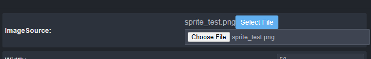
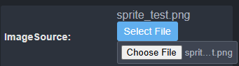
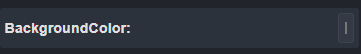

# Welcome to the Forge Engine Context

## Project Overview
This project is a game engine, called Forge. The engine follows a "Game Tree" concept, where each node in the tree is a Part, and the parent node is the game itself. A parent node (Part) calls its act() method each tick, then calls its childrens act() methods. There is a web-based engine that uses the engine core to facilitate easier build of games.

## Machine Overview
- You are running on a windows machine. Please use powershell commands by defualt

## Code Overview
- Examine ./docs for documentation of the project
- Examine ./Parts for the code on each built-in part
- Examine ./engine for the code that runs the web engine. Ignore the .js files (specifically, bundle.js, editor.js, script.bak.js, and defs.bak.js), as the project is built using ts and these are just the build files.

## Tasks

## Tasks

- Property type "File" looks ugly. 

- `Uncaught (in promise) ReferenceError: spritesheetImage is not defined`: This occurs when adding spritesheet JSON, then adding actual spritesheet image, and running. Also, there are duplicate properties for spritesheet image. One appears when adding the JSON. Remove that one. Also on AnimatedSprite, when spritesheet JSON is loaded, use meta.startingAnimation to pre-load starting animation into the property.
- Add an "enum" type in definitions.ts and when rendering properties that shows up as a select input.
- Use this enum type for starting animation selection in AnimatedSprite (load it when spritesheet JSON is loaded)
- When dragging/dropping nodes around in the heigharchy, they just dissappear instead of actually being moved. Note: when fixing this, if a node of the same name already exists, change node.properties.name and add -1 (or increment the number after the dash if that node already exists)
- Once an error occurs (Eg: Error: No scenes available to start the game.), the canvas is removed. This means that attempts to access the canvas result in an error. Fix this, and just set canvas.style.display to none in order to allow access to the canvas element
- Color inputs don't show the actual color (see image below). Make the input wider to support this

- `ALT + P` shortcut does not properly start/pause the game. Please debug. It only pauses/resumes it. It should start it if no game is running