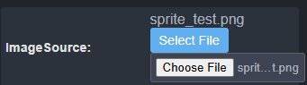

## Tasks

- Property type "File" looks ugly. 

- `Uncaught (in promise) ReferenceError: spritesheetImage is not defined`: This occurs when adding spritesheet JSON, then adding actual spritesheet image, and running. Also, there are duplicate properties for spritesheet image. One appears when adding the JSON. Remove that one. Also on AnimatedSprite, when spritesheet JSON is loaded, use meta.startingAnimation to pre-load starting animation into the property.
- Add an "enum" type in definitions.ts and when rendering properties that shows up as a select input.
- Use this enum type for starting animation selection in AnimatedSprite (load it when spritesheet JSON is loaded)
- When dragging/dropping nodes around in the heigharchy, they just dissappear instead of actually being moved. Note: when fixing this, if a node of the same name already exists, change node.properties.name and add -1 (or increment the number after the dash if that node already exists)
- Once an error occurs (Eg: Error: No scenes available to start the game.), the canvas is removed. This means that attempts to access the canvas result in an error. Fix this, and just set canvas.style.display to none in order to allow access to the canvas element
- Color inputs don't show the actual color (see image below). Make the input wider to support this
